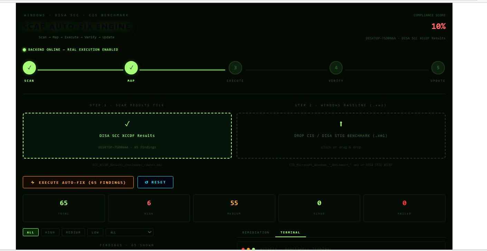
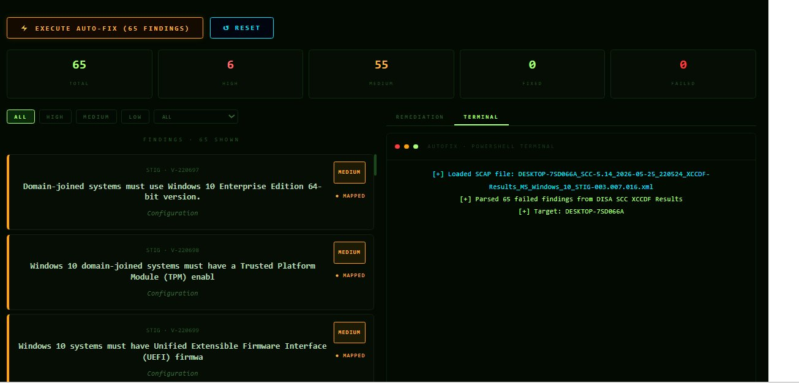
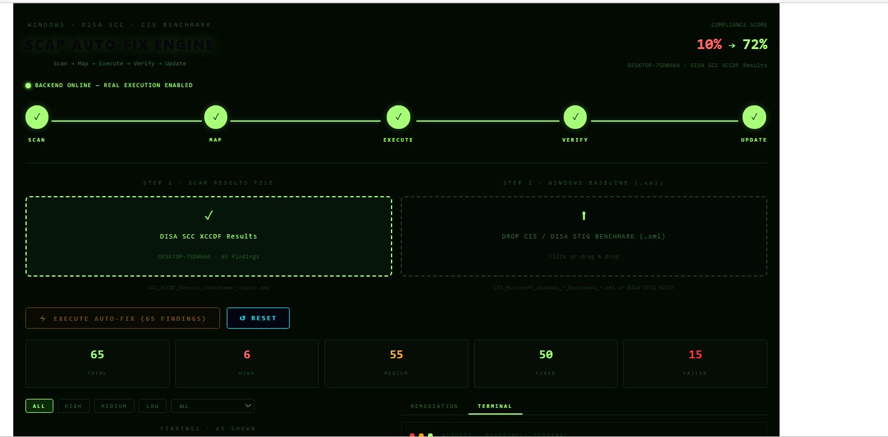
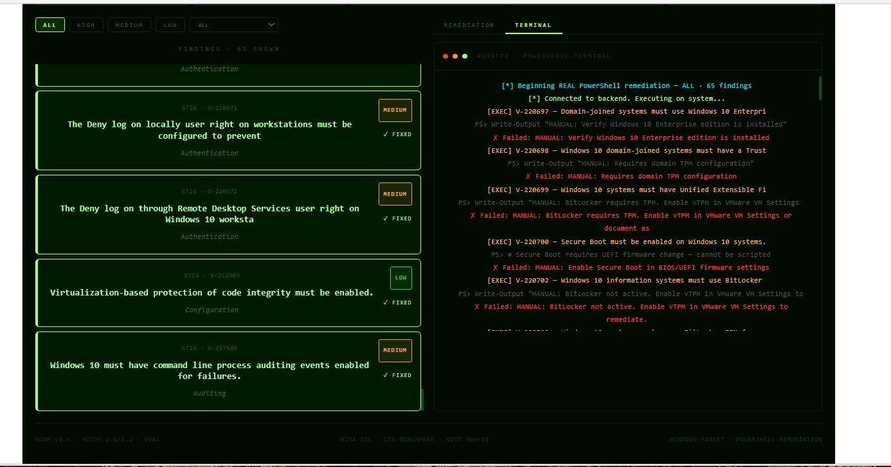

# SCAP Auto-Fix Engine

A full-stack web application that parses DISA SCC XCCDF scan results and executes PowerShell STIG remediation scripts against a Windows 10 target — end-to-end automation from scan output to applied fix.

> **Portfolio project** demonstrating STIG compliance automation for DoD/defense contractor environments.

---

## Overview

The SCAP Auto-Fix Engine bridges the gap between running a DISA SCC scan and actually remediating the findings. Instead of manually cross-referencing each failed STIG check and hunting down the right fix, this tool parses the XCCDF results file, maps each finding to its PowerShell remediation command, and executes the fix against the local Windows machine — all through a clean web UI.

The remediation library is built directly into the frontend (`App.jsx`) as a keyed object mapping V-numbers to real PowerShell registry, `auditpol`, and `secedit` commands. The Node.js backend receives the command, writes it to a temp `.ps1` file, executes it via `powershell.exe`, and returns the result.

**Target use case:** Security engineers and ISSOs working in DoD or cleared contractor environments who need to automate STIG remediation on Windows endpoints.

---

## Screenshots

**Dashboard — XCCDF results loaded, 65 findings parsed from DESKTOP-7SD066A**


**Findings table — STIG IDs mapped with severity and category**


**After execution — compliance score updated from 10% → 72%, 50 fixed / 15 failed**


**Terminal output — real PowerShell execution with SUCCESS, FAILED, and MANUAL results**


---

## Features

- Drag-and-drop upload for DISA SCC XCCDF results (`.xml`) and CIS Benchmark files
- Parses XCCDF results entirely in the browser — no server-side XML processing
- Supports both DISA SCC and CIS Benchmark formats with automatic detection
- Displays findings by STIG ID, severity (CAT I/II/III), category, and pass/fail status
- Built-in PowerShell remediation library — 100+ Windows 10 STIG V-numbers mapped to real registry/auditpol/secedit commands
- Keyword fallback for unmapped rules
- Flags manual-only findings (BitLocker, PKI, CAC/MFA) with `MANUAL REVIEW REQUIRED`
- Executes remediations against the local Windows machine via Node.js backend
- Real-time terminal output showing PowerShell execution results
- `SUCCESS` / `FAILED` / `MANUAL` status per finding
- Live compliance score with before/after percentage
- Filter findings by severity and category
- Backend health indicator — shows ONLINE/OFFLINE status in the UI

---

## Architecture

```
┌─────────────────────┐         ┌──────────────────────┐
│   React Frontend    │ ──────▶ │   Node.js Backend    │
│   (Vite / React)    │         │    (server.cjs)      │
│                     │ ◀────── │                      │
│  - XCCDF parser     │  :3001  │  - /remediate POST   │
│  - Findings table   │         │  - /ping POST        │
│  - Remediation UI   │         │  - PowerShell exec   │
│  - PS library       │         │                      │
│    (100+ V-numbers) │         └──────────┬───────────┘
└─────────────────────┘                    │
        :5173                              ▼
                                ┌──────────────────────┐
                                │  Windows 10 (local)  │
                                │                      │
                                │  powershell.exe      │
                                │  -ExecutionPolicy    │
                                │  Bypass              │
                                │                      │
                                │  Temp .ps1 written   │
                                │  to C:\Windows\Temp\ │
                                │  executed & deleted  │
                                └──────────────────────┘
```

---

## Tech Stack

| Layer | Technology |
|---|---|
| Frontend | React + Vite |
| Backend | Node.js (built-in `http` module) |
| XML Parsing | Browser `DOMParser` (client-side) |
| Script Execution | `child_process` → `powershell.exe` |
| Remediation Library | 100+ STIG V-numbers → PowerShell commands (built into `App.jsx`) |
| Temp Script Handling | Writes `.ps1` to `C:\Windows\Temp\`, executes, deletes |
| Frontend Port | `http://localhost:5173` |
| Backend Port | `http://127.0.0.1:3001` |
| Target OS | Windows 10 |
| Scan Source | DISA SCC (SCAP Compliance Checker) |
| STIG Reference | DISA Windows 10 STIG V2R9 |

---

## How It Works

1. **Scan** — Run DISA SCC against the Windows 10 machine to produce an XCCDF results file.
2. **Parse** — The React frontend parses the XCCDF `.xml` file using the browser's `DOMParser`, extracting each rule result: STIG ID, title, severity, category, and pass/fail status.
3. **Map** — Each failed finding's V-number is looked up in the built-in `STIG_REMEDIATION` library. If no exact match exists, a keyword fallback generates a best-effort PowerShell command. Manual-only findings are flagged automatically.
4. **Review** — Failed checks are displayed in the findings table. Clicking a finding shows the mapped PowerShell command in the Remediation Detail panel.
5. **Execute** — Clicking Auto-Fix sends each finding's STIG ID, title, and PowerShell command to `POST /remediate` on the backend.
6. **Run** — The backend writes the command to a temp `.ps1` file in `C:\Windows\Temp\`, executes it via `powershell.exe -ExecutionPolicy Bypass -NonInteractive`, then deletes the temp file.
7. **Result** — Output is returned to the UI as `SUCCESS`, `FAILED`, or `MANUAL REVIEW REQUIRED` with real-time terminal logging.

---

## Remediation Coverage

The built-in library covers 100+ Windows 10 STIG V-numbers across the following categories:

| Category | Examples |
|---|---|
| Account / Password Policy | V-220706, V-220707, V-220708, V-220709, V-220710 |
| UAC / Privilege Escalation | V-220711, V-220712, V-220713, V-220944, V-220947 |
| Audit Policy | V-220726 through V-220740, V-220751 through V-220791 |
| Windows Firewall | V-220717, V-220718, V-220719, V-220720, V-220721 |
| NTLM / LSA Hardening | V-220800, V-220802 through V-220808, V-220933, V-220935 |
| SMB / Legacy Protocols | V-220801 (SMBv1 disable) |
| WinRM Security | V-220862, V-220863, V-220865, V-220866, V-220867, V-220868 |
| PowerShell Security | V-220728 (PS v2 disable), V-220860 (script block logging), V-252896 |
| Event Log Sizing | V-220779, V-220780, V-220781 |
| Registry / OS Hardening | V-220794 through V-220798, V-220809 through V-220845 |
| Credential Guard / Device Guard | V-220705, V-252903 |
| User Rights Assignments | V-220959, V-220960, V-220968 through V-220971, V-220982 |
| Manual Review (flagged) | BitLocker (V-220699, V-220702–704), PKI/CAC (V-220903–906), MFA (V-220946) |

---

## Project Structure

```
scap-autofix/
├── src/
│   ├── App.jsx              # Main app — XCCDF parser, STIG remediation
│   │                        # library (100+ V-numbers), UI components
│   ├── App.css              # Styles
│   ├── main.jsx             # Vite entry point
│   └── assets/              # Static assets
├── public/                  # Public assets
├── server.cjs               # Node.js backend — PowerShell execution engine
├── secedit.sdb              # Security database used by secedit remediations
├── index.html               # HTML entry point
├── vite.config.js           # Vite configuration
├── package.json             # Dependencies and scripts
├── eslint.config.js         # ESLint configuration
└── .gitignore
```

---

## Demo

The demo walkthrough covers:

1. Loading a DISA SCC XCCDF results file from a Windows 10 scan
2. Reviewing the findings table — STIG ID, severity (CAT I/II/III), category, status
3. Selecting a failed finding and viewing the mapped PowerShell command
4. Running Auto-Fix and watching real-time terminal output
5. Observing findings flip from `FAIL` to `FIXED` and the compliance score update

---

## Setup

### Prerequisites

- Node.js 18+
- Windows 10 (must run as Administrator)
- DISA SCC to generate XCCDF results
- PowerShell 5.1+

### Install

```bash
git clone https://github.com/Icode42/Scap-Autofix-Engine.git
cd Scap-Autofix-Engine
npm install
```

### Run

```bash
# Terminal 1 — start backend (must be run as Administrator)
node server.cjs

# Terminal 2 — start frontend
npm run dev
```

Open `http://localhost:5173` in your browser.

> **Important:** `server.cjs` must run as Administrator or PowerShell remediations will fail due to insufficient privileges.

---

## Background

This project was built as part of a cybersecurity portfolio focused on DoD compliance automation. The author holds a CompTIA Security+ certification, has a background in DoD telecommunications and CAC/PKI infrastructure, and has worked as an ISSO supporting cleared environments.

This project was developed collaboratively with AI assistance (Claude by Anthropic). The concept, requirements, STIG remediation logic, and testing were driven by the author — AI was used as a development tool to accelerate implementation, similar to how a security engineer might use Copilot or other tooling in a professional environment. The goal was to produce a working, accurate demonstration of STIG automation knowledge rather than to claim authorship of every line of code.

The SCAP Auto-Fix Engine demonstrates practical skills in:

- DISA STIG compliance and SCAP tooling
- Automated remediation workflow design
- Full-stack development (React / Node.js)
- PowerShell scripting for Windows endpoint hardening
- DoD RMF/ATO support tooling concepts

---

## Disclaimer

This tool executes PowerShell scripts with administrative privileges. Use only in authorized lab or test environments. Do not run against production systems without proper change control and authorization.

STIG content is sourced from DISA public guidance. This project is not affiliated with or endorsed by DISA or the Department of Defense.

---

## License

MIT
